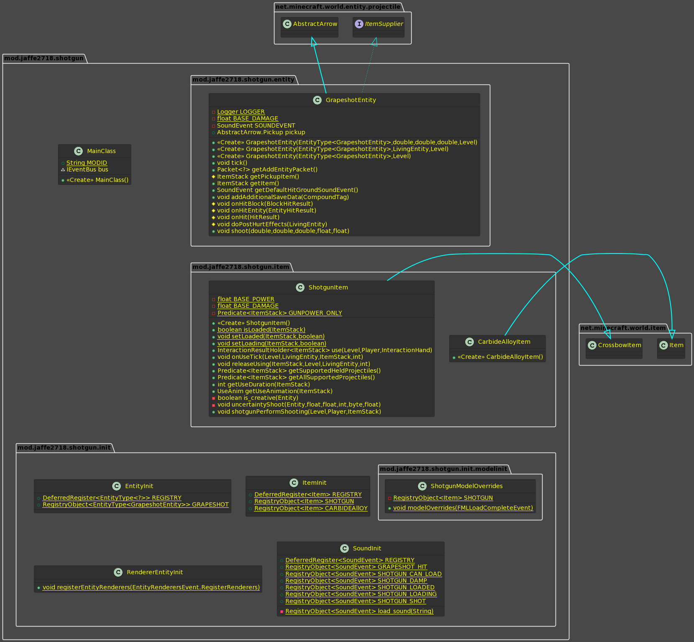

# 霰弹枪模组说明文档

## 使用环境规范

### MDK运行要求

| 项目                        | 参数                   |
|:------------------------- | -------------------- |
| Java Devalopment kit      | 17.x / 18.x          |
| Gradle                    | 由项目自动下载              |
| IDE（推荐JetBrains IntelliJ） | Community / Ultimate |

### 模组运行要求

| 项目                      | 参数              |
| ----------------------- | --------------- |
| Java Devalopment kit    | 17.x / 18.x     |
| Minecraft: Java Edition | 1.19.x          |
| Forge                   | 推荐最新版或者稳定版      |
| 启动器                     | 推荐BakaXL Public |

### 玩法说明

> 霰弹枪的合成需要铁粒、木材、绊线钩和模组特有的碳化合金，具体合成表如下：
> 
> 
> 
> 而碳化合金的合成需要铜锭、金锭、铁锭，还需要煤炭块，合成方式如下：
> 
> 
> 
> 霰弹枪使用火药作为弹药，总耐久度100。

### 1.1.0 更新说明
```
1. 更精细的粒子效果：现在霰弹击中方块会扬起灰烬。
2. 武器属性调整：
   (1) 加入伤害衰减算法，射击距离在25米以上就会产生伤害衰减，距离越远伤害衰减程度越大
   (2) 会心一击：在3米以内击中敌人有单粒霰弹有1/70的概率产生会心一击，伤害高达75（37.5♡）！！！
       会心一击有特有的粒子效果,给霰弹枪附上穿透魔咒可以增加单次射击霰弹颗粒的数量。
   (3) 在水中无法使用霰弹枪。
```

## 项目结构 

```
\---src
    +---generated
    |   \---resources
    +---main
    |   +---java                                  // 代码区
    |   |   \---mod
    |   |       \---jaffe2718
    |   |           \---shotgun                   
    |   |               |   MainClass.java                       // 模组的主类
    |   |               |
    |   |               +---entity                // 实体包
    |   |               |       GrapeshotEntity.java             // 霰弹实体类
    |   |               |
    |   |               +---init                  // 注册类的包，注册游戏元素
    |   |               |   |   EntityInit.java                  // 用于注册实体的类
    |   |               |   |   ItemInit.java                    // 用于注册物品的类
    |   |               |   |   SoundInit.java                   // 用于注册音效的类
    |   |               |   |
    |   |               |   +---modelinit        // 加载模型类
    |   |               |   |       ShotgunModelOverrides.java   // 动态模型
    |   |               |   |
    |   |               |   \---RendererInit     // 渲染类
    |   |               |           RendererEntityInit.java      //注册实体渲染事件的类
    |   |               |
    |   |               \---item                 // 物品包
    |   |                       CarbideAlloyItem.java            // 碳化合金物品类
    |   |                       ShotgunItem.java                 // 霰弹枪物品类
    |   |
    |   \---resources                            // 资源区
    |       |   pack.mcmeta                      // 配置文件、包的元数据
    |       |   shotgunicon.png                  // 模组的icon
    |       |
    |       +---assets
    |       |   \---shotgun
    |       |       |   sounds.json              // 用于声明音效文件
    |       |       |
    |       |       +---lang                     // 将模组的元素进行翻译
    |       |       |       en_us.json                           // 英语本地化 
    |       |       |       zh_cn.json                           // 中文本地化
    |       |       |
    |       |       +---models
    |       |       |   +---custom               // 原始模型，用于Overrides
    |       |       |   |       shotgun_custom.json              // 霰弹枪原始模型
    |       |       |   |       shotgun_loaded.json              // 已装填模型
    |       |       |   |       shotgun_loading_0.json           // 装载中模型0
    |       |       |   |       shotgun_loading_1.json           // 装载中模型1
    |       |       |   |       shotgun_loading_2.json           // 装载中模型2
    |       |       |   |
    |       |       |   \---item                 // 物品模型
    |       |       |           carbide_alloy.json               // 碳化合金物品模型
    |       |       |           shotgun.json                     // 霰弹枪物品模型
    |       |       |
    |       |       +---sounds                   // 音效文件
    |       |       |       grapeshot_hit.ogg                    // 霰弹击中方块音效
    |       |       |       shotgun_can_load.ogg                 // 霰弹枪装填就绪音效
    |       |       |       shotgun_damp.ogg                     // 霰弹枪受潮音效
    |       |       |       shotgun_loaded.ogg                   // 霰弹枪装填完成音效
    |       |       |       shotgun_loading.ogg                  // 霰弹枪装填中音效
    |       |       |       shotgun_shot.ogg                     // 霰弹枪射击音效
    |       |       |
    |       |       \---textures                // 纹理
    |       |           \---item                // 物品纹理
    |       |                   carbide_alloy.png                // 碳化合金物品纹理
    |       |                   shotgun.png                      // 霰弹枪物品纹理
    |       |                   shotgun_loaded.png               // 已装填的霰弹枪纹理
    |       |
    |       +---data                            // 数据包
    |       |   \---shotgun
    |       |       \---recipes                 // 合成表
    |       |               alchemy.json                         // 碳化合金合成表
    |       |               shotgun_formula.json                 // 霰弹枪合成表
    |       |
    |       \---META-INF
    |               mods.toml                                    // 模组信息元数据
    |
    \---test
        +---java
        \---resources
```

### 项目类图展示



# 下面引用自Forge MDK的官方使用说明

Source installation information for modders
-------------------------------------------

This code follows the Minecraft Forge installation methodology. It will apply
some small patches to the vanilla MCP source code, giving you and it access 
to some of the data and functions you need to build a successful mod.

Note also that the patches are built against "un-renamed" MCP source code (aka
SRG Names) - this means that you will not be able to read them directly against
normal code.

Setup Process:
==============================

Step 1: Open your command-line and browse to the folder where you extracted the zip file.

Step 2: You're left with a choice.
If you prefer to use Eclipse:

1. Run the following command: `gradlew genEclipseRuns` (`./gradlew genEclipseRuns` if you are on Mac/Linux)
2. Open Eclipse, Import > Existing Gradle Project > Select Folder 
   or run `gradlew eclipse` to generate the project.

If you prefer to use IntelliJ:

1. Open IDEA, and import project.
2. Select your build.gradle file and have it import.
3. Run the following command: `gradlew genIntellijRuns` (`./gradlew genIntellijRuns` if you are on Mac/Linux)
4. Refresh the Gradle Project in IDEA if required.

If at any point you are missing libraries in your IDE, or you've run into problems you can 
run `gradlew --refresh-dependencies` to refresh the local cache. `gradlew clean` to reset everything 
{this does not affect your code} and then start the process again.

Mapping Names:
=============================

By default, the MDK is configured to use the official mapping names from Mojang for methods and fields 
in the Minecraft codebase. These names are covered by a specific license. All modders should be aware of this
license, if you do not agree with it you can change your mapping names to other crowdsourced names in your 
build.gradle. For the latest license text, refer to the mapping file itself, or the reference copy here:
https://github.com/MinecraftForge/MCPConfig/blob/master/Mojang.md

Additional Resources:
=========================

Community Documentation: https://mcforge.readthedocs.io/en/latest/gettingstarted/  
LexManos' Install Video: https://www.youtube.com/watch?v=8VEdtQLuLO0  
Forge Forum: https://forums.minecraftforge.net/  
Forge Discord: https://discord.gg/UvedJ9m  
